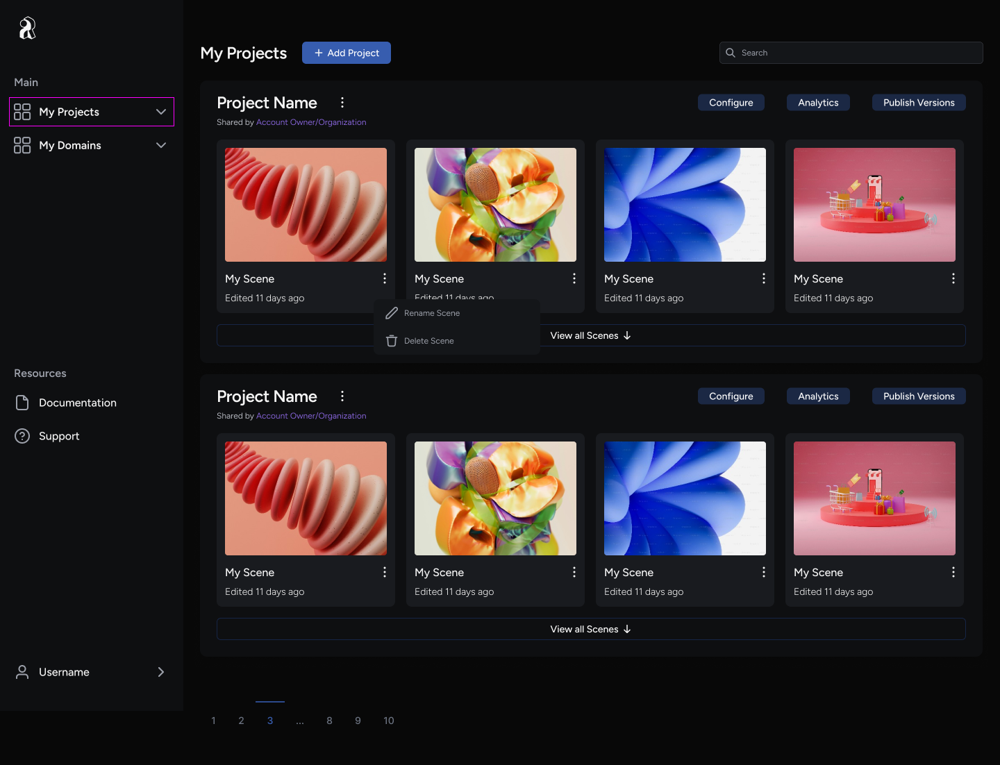
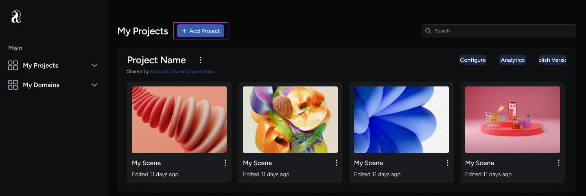

Learn to create your first project in the iR Engine.

## Access the Console

To create a project, you need to access the **Console**, your central project management hub. Follow these steps:

1. Go to [preview.ir.world](http://preview.ir.world/) to open the engine.
2. Log into the iR Engine using your credentials.

Once you log into the Console, you immediately land on the **My Projects** page.

Figure 1. **My Projects** page displaying your current projects.

## Create a new project

The **My Projects** page displays all your existing projects. If you have no projects yet, this list will be empty.

**To create a new project**:

1. Click the **Add Project** button at the top of the page.
2. Enter a unique **Project Name** for your experience.
3. Set **Your domain URL**, where users can go to visit your content.
4. Click **Launch Studio** to finalize the creation of your project and open the editor.

You are now directed to the **Studio**, where you can begin your creative work and start building your space.

## Next steps: Add scenes to your project

You have successfully created your first project in the iR Engine. You can now proceed to [add scenes to your project](/scene-development/building-and-managing-scenes/add-scenes-to-your-project).
