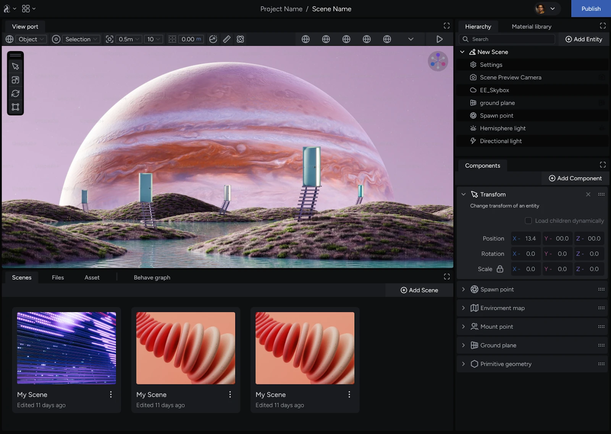

Learn about the Studio's core functionalities to empower you to build compelling virtual worlds with the iR Engine.

## About the Studio

The **Studio** is a comprehensive 3D editing environment for creating interactive virtual experiences. Utilizing a robust set of tools and UI elements, camera controls, dynamic lighting, interactivity, and more, iR Engine’s Studio empowers you to build immersive worlds you have never experienced before.

:::note

As a cornerstone of the creative process, the iR Studio is all you need to get started authoring your own virtual worlds and dynamic web experiences.

:::

## Scene composition and management

The Studio functions as a scene composition tool. Here you can:

- **Compose scenes:** Create environments within your project out of elements in your scene. Add models, images, audio and more to your virtual experience.
- **Layout assets and manage content:** Build scenes with assets provided in the Asset Library or import your own 3D files.
- **Build prefabs:** Create or edit collections of components to attach function and features to objects and fine-tune the behavior and properties of elements in your scene.
- **Set lighting and ambiance:** Create the desired atmosphere for your scene by manipulating lighting sources and applying post-processing to achieve the desired look of your world.
- **Preview and test your scene:** Test and refine your scene in real-time using the built-in preview functionality. This feature lets you iterate your design’s and experience your world as a user might.
- **Publish your project:** Once your scene is complete, you can publish it to a designated location and easily invite users to experience your world with a URL.

## Project and scene organization

The virtual experiences you create within the Studio can be organized into hierarchical structures:

- **Projects:** Manage a single scene or a collection of scene’s within a project. You can link scene’s together under one Project and expand how a user might experience your world.
- **Scenes:** Individual scenes act as the building blocks within a project. They house all the components that define your experience, such as 3D models, collision detection elements (colliders), camera views, audio sources, and more.

## Asset management

The Studio supports a wide range of asset formats and categories to enhance your virtual world, from pre-built assets to custom creations.

### Format support

Supported file formats include:

- **3D model formats:** `.glb`, `.gltf`
  - The Studio does not support `.fbx`
- **Image formats:** `.png`, `.tiff`, `.jpeg`
- **Audio formats:** `.mp3`, `.mpeg`, `.m4a`, `.wav`
- **Video formats:** `.mp4`, `.mkv`, `.avi`

### Supported asset categories

The Studio offers a wide variety of assets to bring your virtual world to life:

| Category | Description |
| --- | --- |
| Default Prefabs | Commonly used configurations of components |
| 3D Models | From basic shapes to characters, furniture, and nature elements. |
| Templates | Pre-designed environments to jumpstart your creative process. |
| Kits | Themed collections of models you can use for efficient world-building (e.g., Gothic architecture, modern furniture). |
| Lights | Various light sources like point lights, spotlights, and pre-configured setups to create the desired atmosphere. |
| Materials | Define surface properties like roughness and reflectivity for realistic objects. |
| Advanced Materials | Materials with dynamic layers or animations |
| Textures and Images | Apply visual details to your 3D models, such as photos, paintings, and patterns. |
| Particles | Animated effects that use particles and sprite sheets, fire, smoke, sparkles, etc. |
| Audio and Video | Integrate sound effects, background music, and ambient videos. |
| Behaviors and Visual Scripting recipes | Pre-built scripts to add interactivity and define object behaviors. |
| Skyboxes | Pre-configured environments for your scene, including various neutral, time of day, and artistic styles. |
| User-imported assets | Import your own custom 3D models, textures, and other compatible file formats. |

:::tip[Learn more about assets]
Consult the [Asset types](https://tsu.atlassian.net/wiki/spaces/IREE/pages/2307031053) guide for an in-depth view of assets available in the engine.
:::

### Beyond pre-built assets

While the Studio offers a vast collection of pre-built assets, it also empowers you to leverage your own creative resources. Import custom 3D models, images, videos, audio files, or avatars into the engine to use in your projects.

### Recommended file size

For optimal performance, *use files under 300 MB*. Files over this size affect the performance of your experience both when building it in the Studio and when users access it on the web.

Consider [optimizing your asset](https://tsu.atlassian.net/wiki/spaces/IREE/pages/2313584662) to help reduce file size and ensure a smooth experience for both you and your users.

## Accessing the Studio

You can access the Studio by:

- **Starting a new project:** Create a new project in the **Console** to start building a fresh virtual experience.
- **Opening an existing project:** While inside the **Console**, simply select any scene from an existing project to launch it in the Studio.

Opening scenes automatically launches the Studio, where you can then load and edit the project's individual scenes.