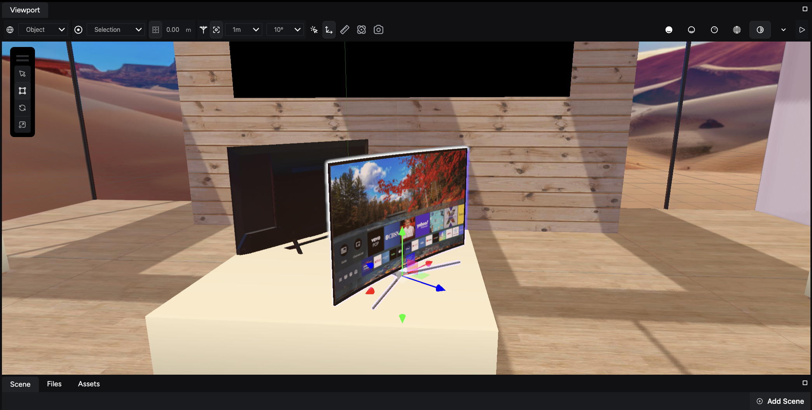

This guide outlines the fundamental Viewport navigation controls using a mouse and keyboard.

:::tip[Tip: Use a mouse and a keyboard]
While trackpads offer basic functionality, a mouse with a scroll wheel *is strongly recommended* for precise Viewport control.
:::

## About the Viewport

The **Viewport** is your main workspace in the Studio. It displays all active entities in your scene and acts as a window into your virtual world, where you can navigate, preview, and edit the elements of your scene in real time.

:::note
Consult the [Viewport panel](/get-started/ir-engine-studio/studio-interface/viewport-panel) guide to learn about the actions you can perform in the Viewport.
:::

## Mouse actions

The mouse controls available for the Viewport are:

| Action | Mouse input | Description |
| --- | --- | --- |
| Fly | Right-click + **WASD** keys | Navigate freely within the 3D environment in a first-person perspective. |
| Rotate | Left-click and drag | Orbit the camera around the point where you clicked, changing the viewing angle. |
| Pan | Middle-click (scroll wheel click) and drag | Move the camera horizontally or vertically within the Viewport without changing the viewing angle. |
| Zoom | Scroll wheel | Adjust the camera's focal length to zoom in or out, changing the field of view. |

## Additional keyboard controls

The keyboard controls available for the Viewport are:

| Action | Key | Description |
| --- | --- | --- |
| Focus (frame) | **F** | Center the Viewport on the currently selected object(s). |
| Deselect | **Escape** | Clear the current selection of objects. |
| Switch transform tool | **W**, **E**, or **R** | Change the active transform tool to translate, rotate, or scale, respectively. |

By mastering these controls, you can navigate the Viewport efficiently, enabling you to create and modify your 3D scenes with greater ease and precision.
