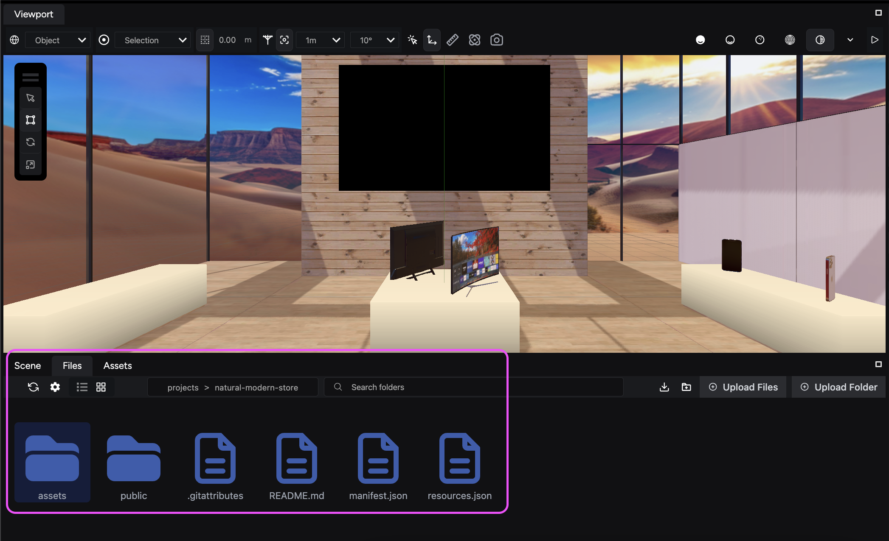

The **File Browser** panel in IR Engine's Studio organizes and manages your project's files. It contains all the system files you need to run your scenes, as well as your manually uploaded assets.

You can access the engine’s file browser through the **Files** tab:

Files you upload appear inside the `assets` folder.

:::note
Because the **Files** tab contains crucial system files to run your engine, all the files outside of assets  and public folders are read-only and cannot be modified.
:::

## Visualizing your assets

Assets inside the **File Browser** and **Assets Panel** have icons to provide a visual reference. We recommend using the **Assets** tab to view all files available for use in your scene. Upon import, you can choose to add imported files to your **User Library**.

## Exploring the file browser's options

The toolbar at the top of the File Browser offers various functions to streamline your file management:

The following table describes each option available in the toolbar so you can manage your project’s files efficiently:

| Option | Description |
| --- | --- |
| **Refresh**  | Reload the current folder to see any recent changes. |
| **View options**  | Customize the File Browser's appearance, including adjusting font size and enabling or disabling specific columns. |
| **Show items as**  | Choose to view your files as a list or thumbnails. |
| **File location bar** | Click on this bar to see the current folder's location within your project hierarchy and navigate directly to any folder. |
| **Search bar**  | Quickly locate specific files within your project using the search function. |
| **Create folder**  | Add a new folder within the current directory to organize your project further. |
| **Download project**  | Create a zip archive of your entire project for backup or sharing purposes. |

Master these tools to effectively navigate and manage your project's assets within IR Engine Studio.
