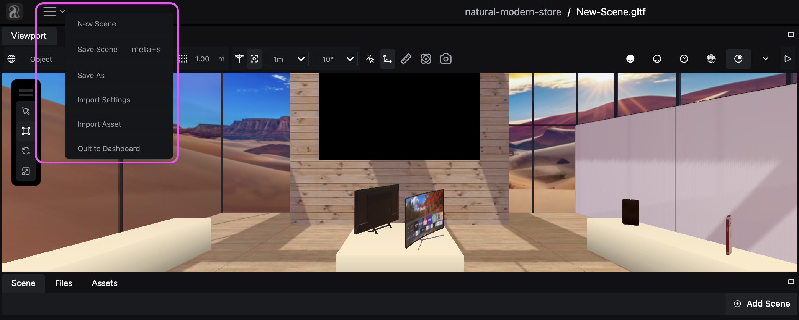
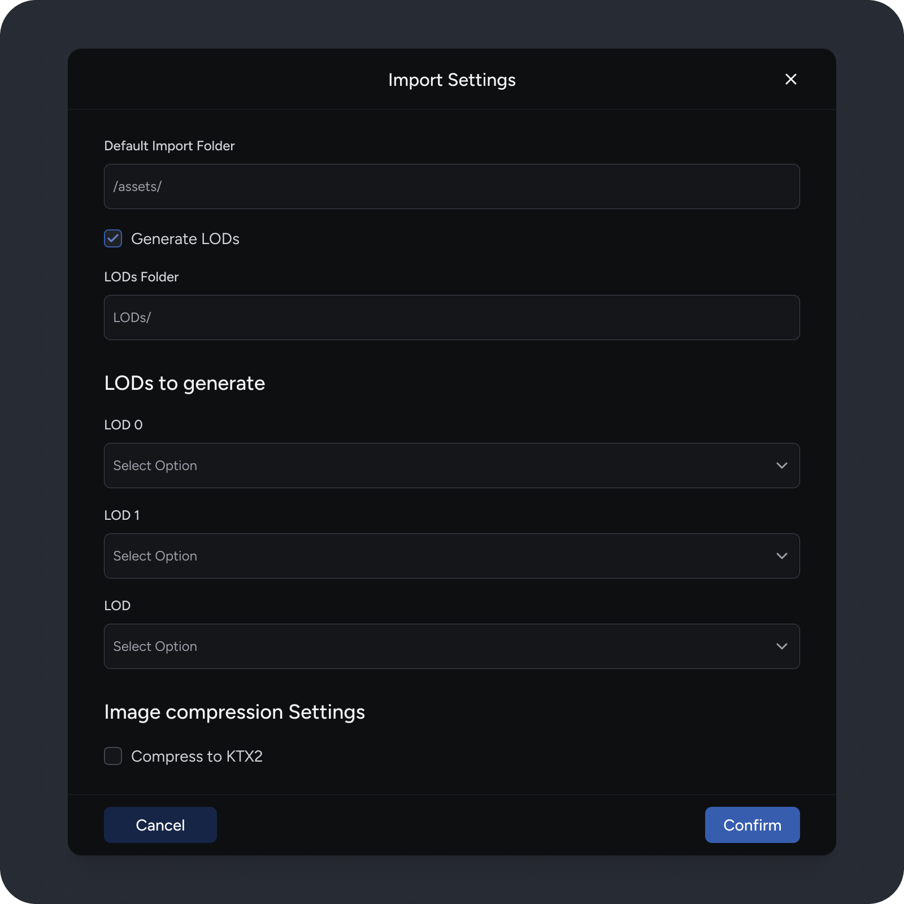

The **Hamburger menu (☰**) in the top left corner of the Studio opens file-related options, providing tools to manage your scenes, configure import settings, and more.

## Available options

Here's a breakdown of the available options:

### Create a new scene

Start by creating an empty scene to work within the editor.

### Save your scene

Preserve your work by saving your currently active scene.

**Keyboard shortcut:**

To perform a quick save:

- **On Windows**: Press **Ctrl** + **S**
- **On Mac**: Press **Command** key (**⌘**) + **S**

### Save as

Use this option to save your current scene with a new filename and location.

### Import settings

Configure how you import assets into your scenes. This menu allows you to do the following:

- **Set your default import folder:** Decide where you want imported assets to be automatically saved.
- **Generate LODs:** Improve performance by enabling automatic generation of different detail levels (LODs) for imported glTF and GLB files.
- **Configure image compression settings:** Adjust the compression level used for imported images to balance file size and image quality.

### Quit to dashboard

Leave your current scene and return to your **Projects** dashboard in the Console.
