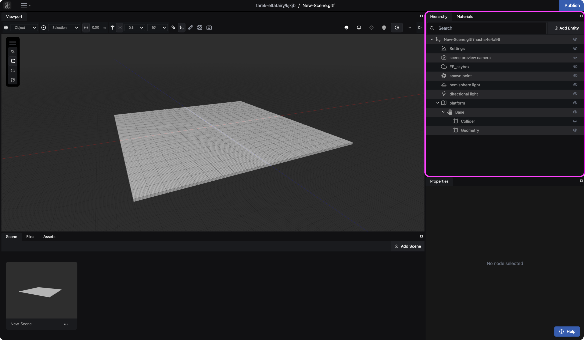
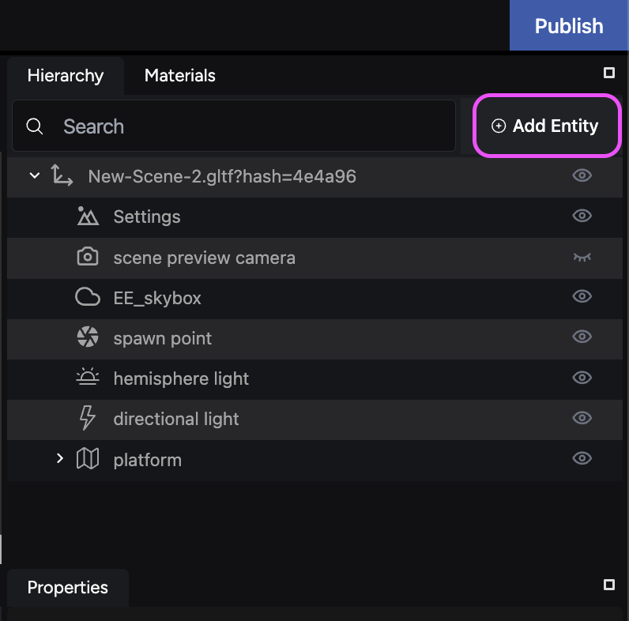
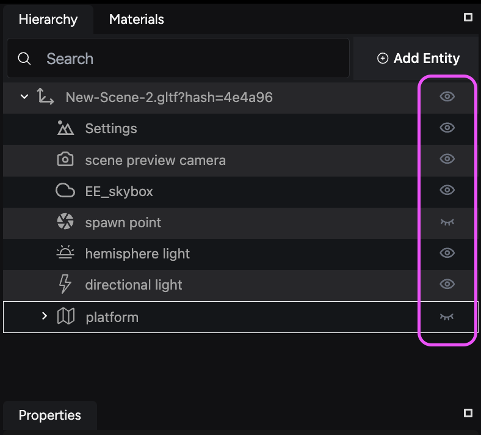
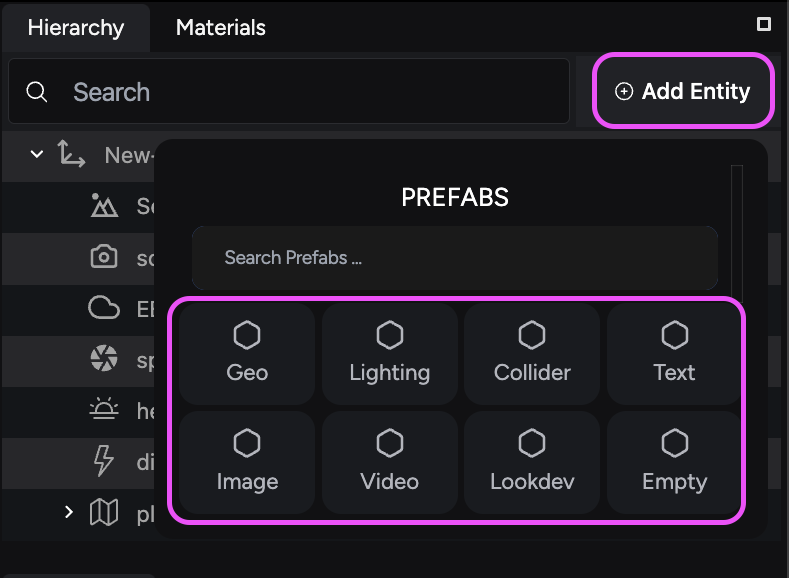

The **Hierarchy** panel serves as the foundation for structuring your scene. It provides a comprehensive view of all **entities** within your project, which are the building blocks that bring your scene to life. These entities can range from geometric shapes to abstract elements like lighting and effects.

## Key features

The Hierarchy panel empowers you to monitor and build dynamic scenes with unique elements.

- **Create new entities:** Utilize the **Add Entity** button to introduce new entities and select their type.

- **Search for entities:** Quickly locate specific entities within your scene using the search functionality.
- **Manage order of appearance:** Organize the entity shelf to your liking.
- **Show and hide entities:** Toggle visibility on objects in your scene.

- **Entity manipulation:** Rename, duplicate, group, copy, paste, and delete entities to manage your scene organization efficiently.

## Working with Entities

Adding new entities is simple. Click the **Add Entity** button and choose the desired entity type.

## Entity categories

The creation process offers a variety of categories to suit your needs. You can choose from:

| Category | Description |
| --- | --- |
| Empty | Inserts an empty entity to your hierarchy that you can build components on. |
| Geo | Add a model component where you can input a 3D file, select a basic primitive shape, or add a ground plane to your scene. |
| Lighting | Add various lights to your scene. Choose from point lights, spotlights, directional lights, ambient lights, or hemisphere lights. |
| Collider | Define the collision shape of an entity for physics interactions. Options include box, sphere, cylinder, and mesh colliders. |
| Text | Insert non-interactive text elements into your scene. Text entities are useful for titles, labels, instructions, captions, or other informational content. |
| LookDev | LookDev entities influence the overall visual style of your scene, including the skybox, fog, and post-processing effects. |

By effectively utilizing the **Hierarchy** panel, you can establish a well-organized scene structure, making it easier to manage and manipulate your virtual world.