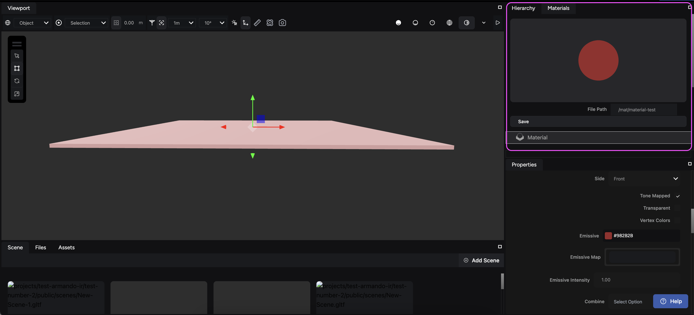
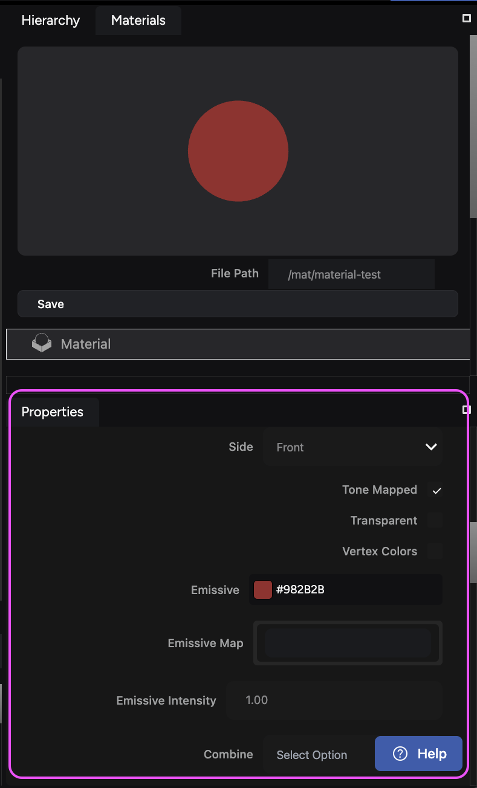
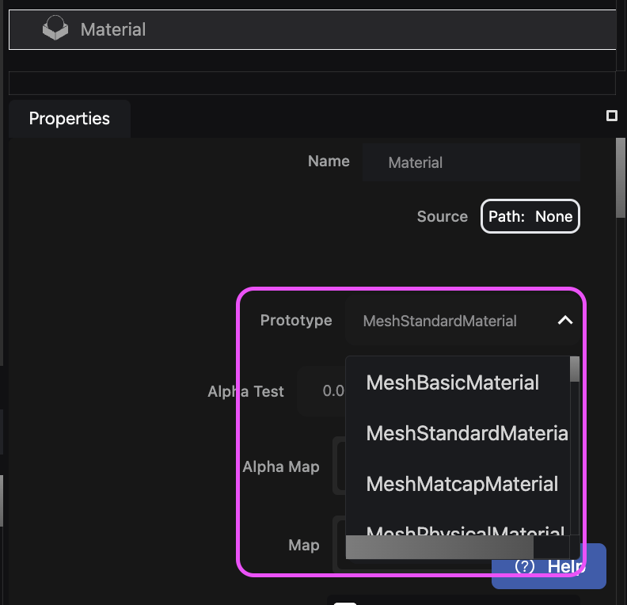

import { Steps } from '@astrojs/starlight/components';

The **Materials** **inspector** is your central hub for manipulating the materials on a model or entities. It offers a robust set of tools for fine-tuning the look and feel of objects in your scene. You can import textures, tweak properties, and input various maps to achieve lifelike results on the web.

## Manage entity materials

To manage the materials of your entities in your scene, follow these steps:

<Steps>

1. **Select your entity:** Choose an entity in the **Hierarchy** panel.
2. **View its materials:** Navigate to the **Materials** tab to view a list of all materials currently applied to the selected entity.
3. **Adjust its properties:** Modify the properties of each material within the **Properties** panel under **Materials**.

</Steps>

## Material prototypes

The engine offers extensive support for various materials, each catering to specific visual requirements. These materials provide a foundation for creating various surface effects.

We recommend you use **MeshPhysicalMaterial** for transparent materials or objects that require Clearcoat like car paint.

Choose between different prototypes in the **Properties** panel:

### Basic materials

This section explores some fundamental material types used for common rendering tasks:

| Material                  | Description                                                                                     | Ideal use cases                  |
|---------------------------|-------------------------------------------------------------------------------------------------|----------------------------------|
| **MeshBasicMaterial**     | Applies a uniform color with no lighting effects.                                               | Simple geometries, flat surfaces |
| **MeshStandardMaterial**  | Implements physically based shading (PBS) for realistic lighting responses.                     | Metals, plastics, wood           |
| **MeshMatcapMaterial**    | Employs a pre-rendered texture for cartoon-like shading. Efficient for low-complexity scenes.   | Cartoon rendering                |
| **MeshPhysicalMaterial**  | Provides the most accurate shading with light scattering and microfacet effects.                | High-fidelity rendering          |
| **MeshLambertMaterial**   | Calculates diffuse lighting based on surface orientation, omitting specular highlights.         | Matte surfaces                   |
| **MeshPhongMaterial**     | Adds specular highlights using Phong shading, ideal for glossy materials.                       | Metals, plastics                 |
| **MeshToonMaterial**      | Creates a cel-shaded, stylized look with sharp edges and limited color variations.              | Cartoon rendering                |
| **ShaderMaterial**        | Offers complete control over material properties through custom GLSL shaders. (Requires advanced programming skills) | Advanced visual effects |
| **ShadowMaterial**        | Specialized material for generating shadows within the scene. (Not intended for direct object rendering) | Shadow effects       |
| **LineBasicMaterial**     | Renders lines with a uniform color.                                                             | Outlines, edges, simple geometric shapes |

### Advanced materials

While the basic materials provide a solid foundation, these advanced materials offer more specialized functionalities and effects:

| Material                       | Description                                                                                                                      | Potential use cases                    |
|--------------------------------|----------------------------------------------------------------------------------------------------------------------------------|----------------------------------------|
| **HashTiledStandardMaterial**  | Creates non-repeating tiled textures on surfaces with noise functions. Offers control over the scale of the effect.               | Procedural textures                    |
| **SpriteSheetMaterial**        | Animates sprite sheets with controllable speed, ideal for fire or exploration time-based textures.                               | Animated textures, particle effects    |
| **ScrollingTextureMaterial**   | Animates textures by offsetting UV coordinates over time, creating visual movement.                                              | Flowing water, scrolling textures on screens |
| **AnimateVertexMaterial**      | Animates vertex positions with procedural noise effects, allowing control over animation direction (x, y, z), scale, and speed. | Dynamic mesh animations, water wave surfaces, underwater wavy effects |
| **DisplacementMaterial**       | Combines animate vertex effects with displacement maps and scrolling texture effects. Offers control over scrolling texture speed and vertex offset scale. | Detailed terrain, flowing liquids |
| **FadeMaterial (Advanced Users Only)** | Gradually fades between primary and secondary diffuse maps from top to bottom. Both diffuse maps can apply scrolling texture effects and control speed. The fade effect can change speed and shape by applying noise textures. Note: Consider using simpler approaches for basic fading effects. | Complex game effects |
| **CausticMaterial**            | Creates animated caustic light effects on geometry with procedural Voronoi textures. Offers control over caustic color and scale. | Realistic underwater effects, artistic lighting distortions |
| **LavaMaterial**               | Creates a visually realistic lava effect with glowing embers, procedural diffuse color, and animated heat distortion.            | Lava simulations                       |
| **HolographicMaterial**        | Generates a holographic scan line effect. Allows animation of scan line density and color.                                        | Sci-fi aesthetics, holographic displays |
| **BasicStylizeMaterial**       | Offers cel-shaded effects with control over color variation density, enabling creation of more detailed stylized scenes.         | Stylized rendering                     |
| **WaterStylizeMaterial**       | Simulates stylized water with custom shaders using wave patterns. Properties include foam, water tint, and rim color.            | Stylized water effects                 |
| **LinesMaterial**              | Creates animated line effects on mesh surfaces. Offers control over color, density, and can be used for artistic design purposes. | Artistic line rendering, glowing outlines |
| **GodRayMaterial**             | Simulates mesh-based god rays, streaks of light penetrating through smoke, dust, or fog.                                          | Volumetric lighting effects, atmospheric rendering |
| **FlowMaterial**               | Creates flowing UV effects by applying flow maps and diffuse maps, which are ideal for liquid surfaces.                          | Liquid simulations, flowing materials  |
| **WaterSimpleMaterial**        | Simulates a physically based ocean by applying an additional normal map. Offers control over wave speed.                          | Realistic ocean rendering              |
| **VertexColorLerpMaterial**    | Renders geometry with vertex colors, allowing for smooth color interpolation between vertices.                                   | Custom vertex coloring effects         |

## Choose the right material

Select the material based on your desired visual style, performance needs, and object complexity. Experiment with different materials and explore their properties to achieve the desired aesthetic for your project.