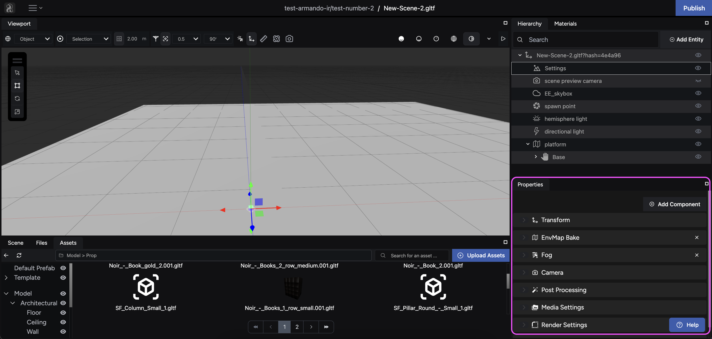
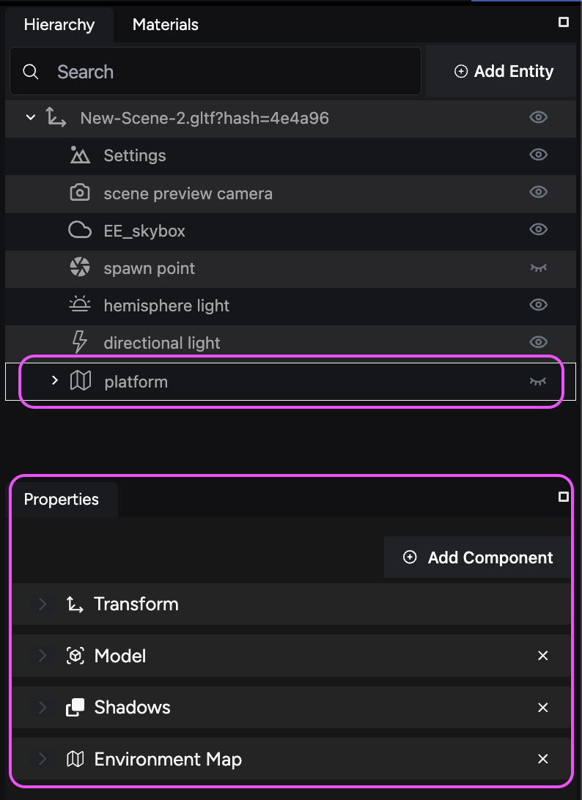
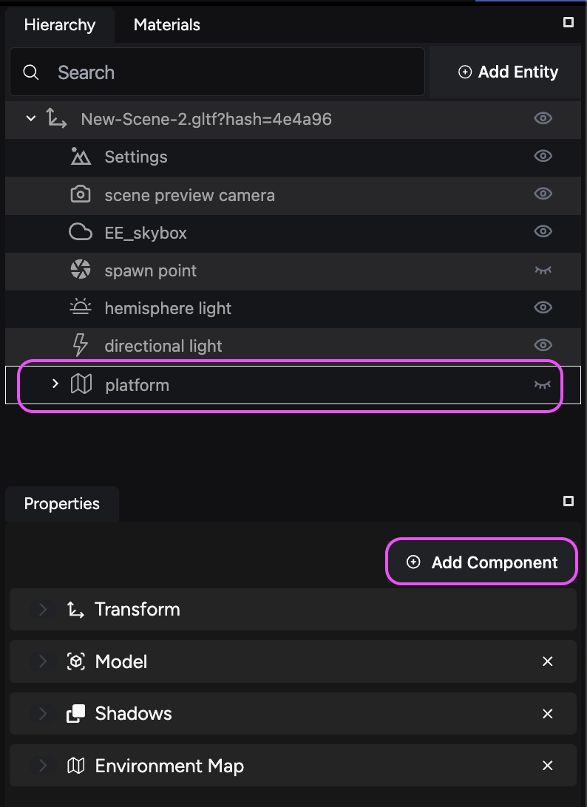

The **Properties** panel gives you complete control over the information that makes up different entities, components, and materials. When you select an entity in the **Hierarchy** panel or a material in the **Materials** tab, you can view and edit its properties in the **Properties** panel.

Use the **Properties** panel to add new components to your entities, configure existing ones, and fine-tune the behavior and appearance of elements in your scene.

## Managing properties of an entity

From the **Properties** panel, after selecting an entity, you can perform the following actions:

### View components

The **Properties** panel lists all components attached to the selected entity.

### Edit properties

Modify the properties of each component directly in the panel.

### Add new components

Use the **Add Component** option to add new components to the selected entity.

## Component properties

Components are categorized based on their functionality. Here’s a breakdown of the component categories:

| Category | Description |
| --- | --- |
| **Transform** | Control the position, rotation, and size of your entity in 3D space using X, Y, and Z values. |
| **Files** | Integrate various media into your scene, such as 3D models with or without animation, audio clips, video, images, and volumetric files. |
| **Physics** | Define how entities interact with the physical world. Set up colliders to define collision areas, add rigid bodies for realistic physical reactions, and create triggers to activate events on contact. By default, all scenes come with a ground plane providing a ground collider. |
| **Interaction** | Design how users and systems interact with your entities. Define spawn points for players, create portals for teleportation, add clickable links, set up interactive objects with visual cues, handle user input, and even allow users to grab or release an object. |
| **Lighting** | Control the mood and illumination of your scene with various light types: ambient light for overall brightness, point lights for focused areas, spotlights for cones of light, directional lights for consistent lighting, and hemisphere lights for overhead illumination. |
| **FX** | Add visual flair to your scene with special effects. Loop animations attached to models, create particle systems for dynamic effects, add environment maps for richer backgrounds, and apply postprocessing to add a cinematic feel to your world. |
| **Scripting** | Bring your scene to life with custom behaviors and logic. Write code or use visual scripting to define how entities interact with objects in the world or user input. |
| **Settings** | Fine-tune the scene’s overall settings, renderer mode, media settings for audio/video, and camera settings. |
| **Scene preview camera** | Set the cover photo for your project by taking a snapshot of the viewport |
| **Miscellaneous** | Explore additional tools, such as environment maps, skyboxes, splines, 3D text, screen sharing, and entity tracking. |

## Experiment with components

Use the properties panel to experiment with different components and their settings. Discover how they work together to bring your scene to life and build your own configurations across your projects.
