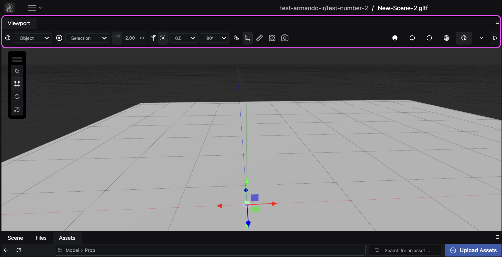
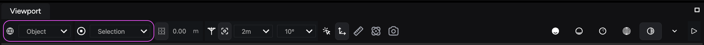
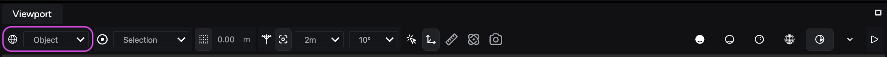
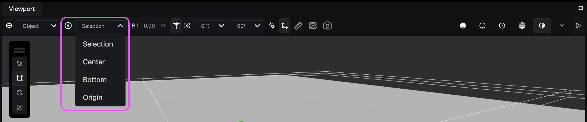
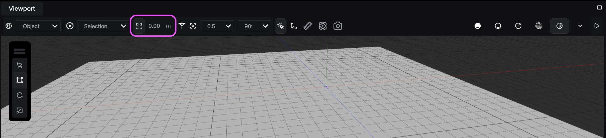
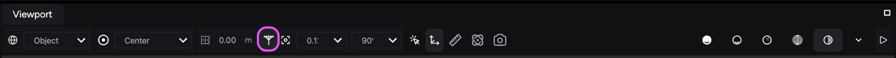
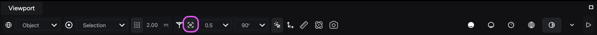
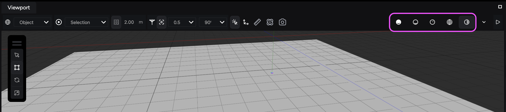
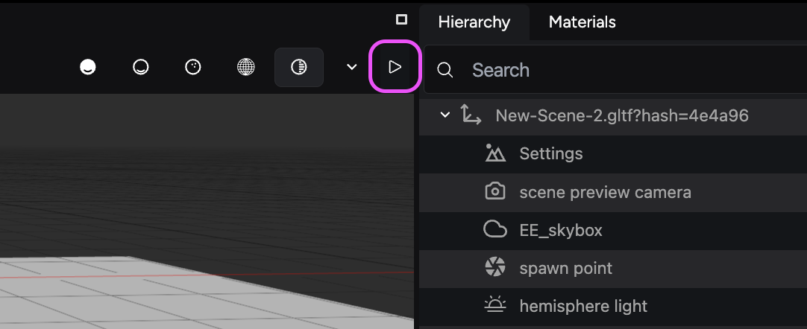
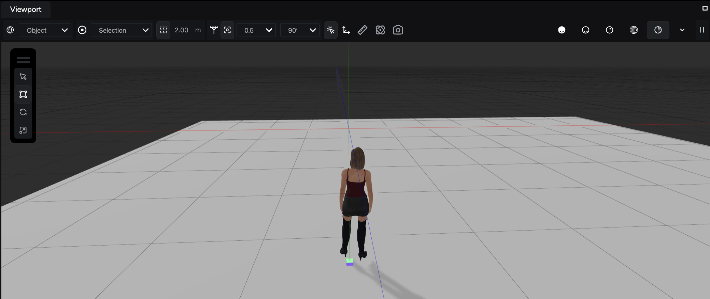

The **Viewport** is your main workspace in the Studio. It displays all active entities in your scene and acts as a window into your virtual world, where you can navigate, preview, and edit the elements of your scene in real time.

The shelf at the top provides you with ways to interact with and view assets in your scene. It features interactive gizmos and helpers for editing the scene. Essential manipulation tools like transform modes, grid-snapping and selection modes for world and object space orientation are found here.

## Navigating the Viewport

The Viewport provides intuitive navigation controls to allow you to explore and manipulate your scene effectively. While a trackpad may be used for basic navigation, **a mouse is highly recommended for optimal control.**

:::note[Learn to navigate the Viewport]
Consult the Viewport's [Navigation controls](/get-started/ir-engine-studio/navigation-controls) guide to learn the mouse and keyboard inputs available to control the camera and items within the window.
:::

## Viewport’s toolbar

The Viewport toolbar, located in the upper part of the window, provides a collection of tools to help you manipulate your scene.

## Transform controls

The **transform controls** allow you to manipulate the location, orientation, and position of objects within your scene.

### Transform space

The **transform space** option allows you to switch between two orientation modes for transformations:

- **World space:** Aligns transformations with the scene's global orientation.
- **Object space:** Aligns transformations relative to the orientation of the selected object

:::tip[Keyboard shortcut]

Press **[Z]** to switch between world and object spaces.

:::

### Transform pivots

Transform pivots allow control over the pivot point of one or more objects you have selected, providing flexibility in how you transform an object depending on where a pivot point is located.

The **toggle transform pivot** function offers several pivot options:

- **Selection:** Uses the center pivot of the last selected object.
- **Center:** Positions the pivot at an equal distance from all selected objects.
- **Bottom:** Aligns the pivot at the bottommost point of the final selection while maintaining an equal distance from all objects.
- **Origin:** Sets the pivot to the world origin (0,0,0).

:::tip[Keyboard shortcuts]

- Press **Shift + [Y]**, **[R]**, or **[T]** after selecting objects to toggle transform pivot options.
- Press **[X]** to cycle between **selection**, **center**, or **bottom** pivot modes.

:::

## Grid visibility and spacing

The **grid visibility** toggle allows you to toggle the grid on or off within the Viewport, providing a visual reference for object placement.

Use the value field next to the grid visibility toggle to configure grid spacing by either making the grid larger or smaller.

## Snapping tools

Snapping tools help streamline object manipulation by enabling alignment tools that help you move or scale an object by a precise value vs. moving the object freely in the X, Y & Z coordinates.

### Bounding box snap

The **bounding box snap** toggle snaps objects to the bounding box of other objects for precise alignment.

:::tip[Keyboard shortcut]
Press **[B]** to toggle bounding box snap.
:::

### Grid snapping for objects

The **grid snapping** toggle enables object movement and rotation based on predefined grid units and degree increments.

:::tip[Keyboard shortcuts]

- Press **[C]** to toggle grid snapping.
- Press **[E]** for incremental rotations around the Y-axis, adopting the selected snapping degree value.

:::

**Grid snapping options**:

- **Translate object by a unit of measurement:** Snap objects in the viewport to the grid. Define the spacing in the grid settings
- **Rotate an object by a degree’s value:** Determines the degree amount an object will rotate as opposed to the object rotating freely

## Rendering options

The Viewport panel offers various rendering modes to control how your scene appears. These modes utilize shaders to achieve different visual effects, facilitating your workflow.

### Unlit

The **Unlit** [**insert screenshot**] mode removes all lighting calculations, resulting in a flat, shadowless view of your scene. It's suitable for initial-scene-setup before adding lighting elements.

### Lit

The **Lit** [**insert screenshot**] mode applies lighting calculations but excludes shadows, offering a basic preview of how lighting will affect your scene.

### Normals

The **Normals** [**insert screenshot**] mode displays a special texture map where colors represent the direction of lighting on each surface. This option can be helpful for debugging lighting issues, as variations in color indicate changes in light direction. Normal maps represent textures applied to objects to simulate lighting effects.

### Wireframe

The **Wireframe** [**insert screenshot**] mode displays your scene geometry as a wireframe construction, useful for visualizing polygons and checking the density of a mesh.

### Shadows

The **Shadows** [**insert screenshot**] mode visualizes shadows cast by lights within your scene. Shadows can impact performance, so consider disabling them while working on other aspects of your scene.

### Performance considerations

Switching between render modes, particularly between unlit and lit modes with shadows, can improve performance in the Viewport. Disabling shadows can provide a smoother experience while working on other aspects of your scene.

## Preview scene

The **preview scene** tool allows you to spawn your avatar into the scene at its designated spawn point. This feature is valuable for testing the scene’s navigation and functionality before publishing your scene to the web. We also recommend testing how a user might traverse your space. You can find it here:

After starting the scene preview, your avatar loads into the scene:

## Advanced Viewport actions

The Viewport offers additional functionalities beyond basic navigation, allowing you to perform advanced actions while working with your scene.

- **Open debug options:** Press **[`] (tilde key)** to access the debugging menu.

    This menu provides various tools to aid in debugging your project. You can monitor the status of entities within your scene, systems, and project state to review optimization.

- **Undo/Redo:**
  - **[Ctrl] + [Z]:** Undo the previous action.
  - **[Ctrl] + [Y] (or redo button):** Redo the previously undone action.
- **Clipboard Actions:**
  - **[Ctrl] + [C]:** Copy selected objects to the clipboard.
  - **[Ctrl] + [V]:** Paste copied objects from the clipboard into the scene.
- **Grouping:** Hold **[Ctrl]** and click on an empty entity to create a new group containing the selected objects. Grouping is useful for organizing your scene.
- **Duplication:** Press **[Ctrl] + [D]** to create a duplicate of the selected objects.
- **Multi-Select:** Hold the **[Shift]** key while clicking on objects to select multiple objects simultaneously.

## Deprecated options

**Post-processing settings:** This option is currently set to default and is deprecated, meaning it will be removed in future Studio releases.
