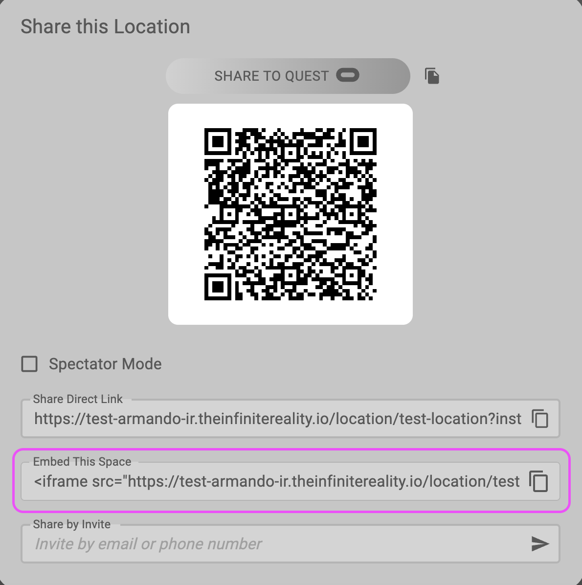

import { Steps } from '@astrojs/starlight/components';

Learn to embed the 3D worlds you create in the Studio into a 2D website using an iFrame.

## Embedding your experience using iFrame

Embedding a virtual 3D world in your website allows visitors to interact with your virtual environment directly from their browsers. You can achieve this by obtaining an iFrame link from the iR Engine and inserting it into your website's HTML.

## Step 1: Access your world location

To begin embedding your virtual world, access the URL of your published location. Follow these steps:

<Steps>

1. **Obtain the URL:** Use the URL provided during the publishing process of your project. You can find it by clicking the **Publish** button at the top right of the page.
2. **Open the experience:** Enter the URL in your web browser to view your virtual experience.

</Steps>

## Step 2: Retrieve the iFrame code

Inside your world, retrieve the iFrame code from the iR Engine Studio to embed the experience on your website. To do this:

<Steps>

1. **Access the share menu:** Click the **Share** button at the bottom center of your screen.
2. **Find the embed code:**
   1. Locate the **Embed this Space** field in the **Share** menu.
   2. Copy the iFrame code from this field to use it for embedding your virtual experience.

</Steps>



## Step 3: Insert the iFrame code into your website

Insert the iFrame code into your website using an HTML editor:

<Steps>

1. **Open your website's HTML editor:** Access the HTML editor of the web page where you want to embed your project. You can do this through your website's content management system (CMS) or directly in the HTML code.
2. **Paste the iFrame code:** Locate the section of your web page where you want your virtual world to appear and paste the copied iFrame code there.
3. **Save and publish your changes:** Save the changes to your web page and publish the updated content. Your virtual experience appears embedded and visible on your website.

</Steps>

## Example iFrame code

Here is an example of what the iFrame code looks like:

```html
htmlCopy code
<iframe
    src="https://<your-subdomain>.theinfinitereality.io/location/<your-location>?instanceId=<your-instance-id>"
    height="100%"
    width="100%"
    allow="camera 'src'; microphone 'src'; xr-spatial-tracking"
    style="pointer-events:all; user-select:none; border:none;">
</iframe>

```

The attributes for the location, such as `height`, `width`, and permissions like `allow`, are configured based on your Studio's publish settings.
