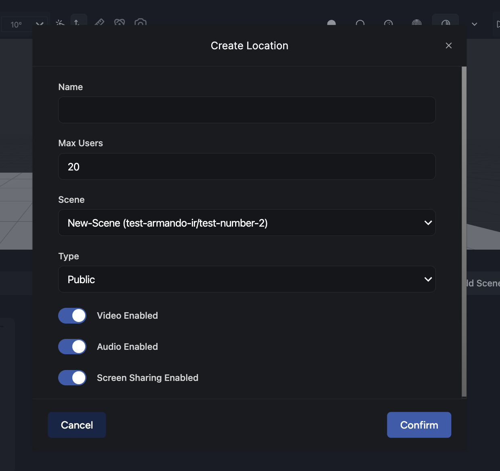

This guide details the process to publish your projects from the **Studio** and making them accessible to users through a URL.

## Publish your project

To publish your project to the web, follow these steps:

1. Open your project in the Studio from the **Console**.
2. Locate the **Publish** button in the top right corner of the Studio. Click this button to initiate the publishing process.

    

    After clicking the **Publish** button, the **Create Location** modal screen appears.

3. Enter the details for your **Location**.
4. Click **Confirm** to publish your experience.

:::tip[What is a Location?]
A **Location** acts as your project's online space, where users can visit your creation through a URL.
:::

Your scene is now published. You can access your **Location** using the generated URL by copying and pasting it into your web browser.

:::caution[Update and save with caution]
Every time you make a change to your scene and save, the location in the published URL gets updated. You can make your experience private if you want to test new saved changes before making them public.
:::

## Set up your Location details

When creating a Location, you can configure its settings. Here’s a breakdown of the options available:

- **Name**: A unique name for your Location. This helps users identify your experience.
- **Max Users**: The maximum number of users who can access the Location simultaneously.
- **Scene**: The scene you want to publish. This is the main environment users will interact with.
- **Type**: Your type of Location, options include:
  - **Private**: Only users with specific access can enter.
  - **Public**: Anyone with the link can access the Location.
  - **Showroom**: A special type of public Location designed for demonstrations.
- **Toggle settings**:
  - **Video Enabled**: Users can share video within the Location.
  - **Audio Enabled**: Users can share audio within the Location.
  - **Screen Sharing Enabled**: Users can share their screens within the Location.

## Additional tips

Here are some additional tips to ensure a smooth publishing process:

- **Test the Location**: Before sharing the link, test the Location in your web browser to ensure everything works as expected.
- **Update settings as needed**: You can always go back and update the location settings if necessary.

## Next steps

After publishing your project, share the Location link with your audience. Monitor user interactions and update your Location settings as needed to ensure an optimal experience.