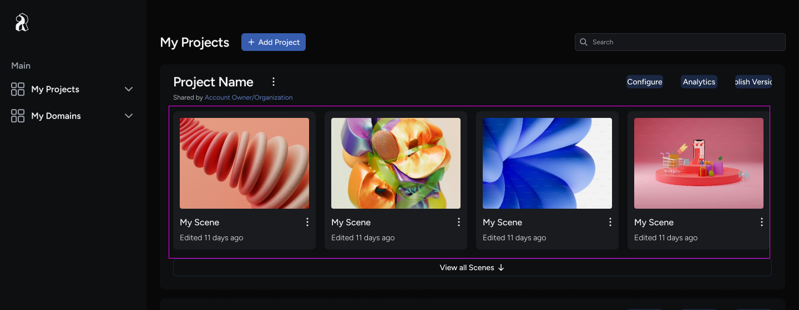
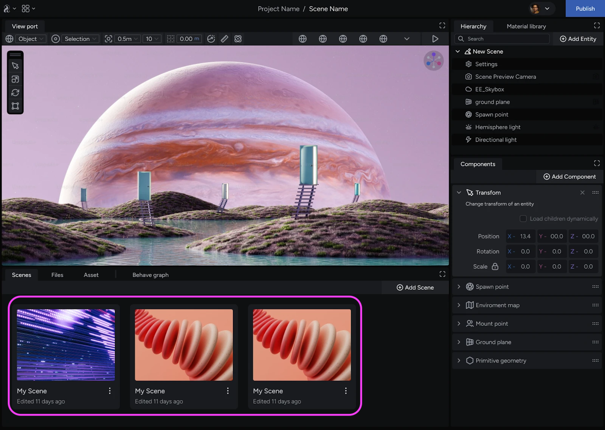
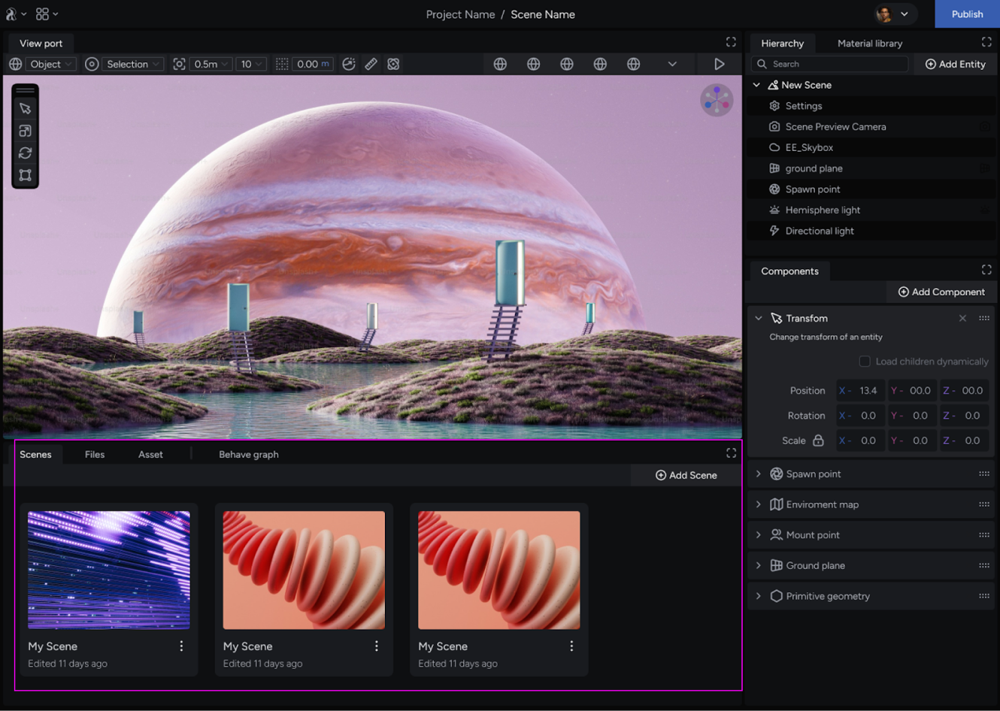

This guide walks you through viewing and creating a scene in your project.

## About scenes

In iR Engine, a project can contain multiple scenes, allowing you to meet a range of project needs within a single domain. A scene is an entity hierarchy that holds all the entities, assets, and components that make up the parts of your project.

## Access the scenes collection

You can access your project’s scenes in the iR Engine in two ways: from the **Console**, and from the **Studio**. The following sections describe each option.

### View scenes from the Console

The My Projects page in the Studio provides an overview of all your projects. Each project displays the scene(s) associated with it in a thumbnail. After opening a scene, you can update a scene thumbnail by updating the **scene preview camera** inside the Studio.

### View scenes from the Studio

Locate the **Scenes** tab at the bottom left of the browser. This tab opens a panel showing the collection of existing scenes associated with the project you are currently working on.

## Create a scene

Follow these steps to add a new scene to your project:

### Create scenes from the Console

1. Go to the **My Projects** page from the left panel.
2. Find the project where you want to create the scene.
3. Click **Add new scene**. This action creates your scene
4. Click the scene you wish to enter to open the Studio.

### Create scenes from the Studio

1. Ensure the **Scenes** tab is active in the lower panel of the Studio. This tab displays all available scenes in your project.

    

2. Click the **Add Scene** button on the right side of the panel. This creates a new scene in your project.

    

3. Optionally, you can rename your scene using the three-dot menu (**…**) on the scene thumbnail for better organization.

After creating your scene, it automatically becomes active, and you can start building your experience.

## Next steps

Now that you have created your first scene in your project, you can proceed to (load assets into your scene)[link] to build your experience.
