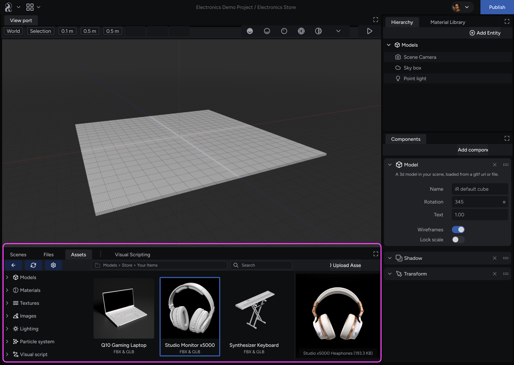

This document provides a comprehensive overview of the asset categories and subcategories available in the **Assets** panel within the Studio. Learn to efficiently locate and use assets to create your virtual experience.

## About assets

The Studio offers a wide variety of pre-built assets to streamline your workflow. You can see these assets in the **Assets panel** within the tab with the same name. The following sections explain the asset categories and the types of assets they contain.

### Prefabs

**Prefabs** are groupings of commonly used components prepackaged into ready-to-use or edit titles. You can configure your own prefabs by building and saving collections of components on an entity. Prefabs assets include:

- **UI:** User interface elements like buttons, menus, and text boxes.
- **Default Prefabs:** An Entity with a Model Component, Animation Component, and Environment Map
- **Text:** Editable text objects for titles, labels, and informational displays.
- **Lighting:** Pre-configured light sources you can drag and drop into your scene.
- **Colliders:** Box, Sphere, Cylinder & Mesh Colliders

### Templates

**Templates** are pre-designed starter scenes to jumpstart your project. These include:

- **Backdrop:** Background elements to establish a scene's setting.
- **Stage:** Pre-built environments themed for specific purposes like:
  - **E-Commerce**: Product displays and interactive shopping experiences.
  - **Art Show**: Galleries to showcase virtual artwork.
  - **Performance**: Stage arrangements for virtual events (needs more info)

### Models

3D **models** that populate your scenes. Their subcategories include:

- **Characters:**
  - **NPC (Non-player character):** Animated characters for your virtual world.
- **Architectural:** Structural elements for building environments:
  - **Floor, Ceiling, Wall:** Basic building blocks for constructing spaces.
- **Basic Shapes:** Simple geometric shapes for versatile use cases:
  - **Artistic/Fractal:** Non-traditional shapes for creative design.
  - **Primitive:** Platonic solids (cube, sphere, etc.) and other fundamental shapes.
  - **Kit:** Collections of objects themed for specific styles.
- **Prop:** Smaller objects to enhance scene detail and interactivity:
  - **Furniture:** Chairs, tables, and other furnishings.
  - **Showcase:** Display units for products or exhibits.
- **Terrain:** Landscapes for creating outdoor environments.

### Materials

Pre-configured surface properties (shaders) for your models. These include:

- **Standard:** Materials for common materials like plastic, glass, and metal.
- **Advanced:** Materials with more complex properties like animation.

### Images: Textures

**Textures** represent two-dimensional visual elements that you can apply to 3D models for surface detail. Besides controlling effects like metallic and reflective properties, they also include:

- **Diffuse:** Define the base color information for a 3D model's surface.
- **Normal maps:** Define surface details like bumps, wrinkles, scratches, and more.
- **Metalness:** Defines how reflective the surface is.
- **Roughness:** Defines how rough or smooth a surface is.
- **Occlusion:** Simulate depth and shadows.
- **ORM:** Embedded Combination of an **Occlusion**, **Roughness**, and **Metalness Map** (recommended for the web)

**Other image types:**

- **Background:** Images used as backdrops for scenes.
- **Sprite:** Two-dimensional images used for visual effects or UI elements that can be played through.

### Light

Pre-configured light sources for illuminating your scenes. Types include:

- **Spot Light**: Focused beams of light.
- **Area Light**: Emissive surfaces that bathe a scene in light.
- **Point Light**: Lights that radiate from a single point.
- **3 Point Light**: A pre-configured setup with three lights for realistic lighting.

### Video

Video clips for use in your virtual experiences.

### Audio

Sound effects and music to enhance immersion:

- **Music:** Background music to set the mood.
- **Sound FX:** Sound effects for actions and events within your scene.

### Particle

Visual effects to apply to your projects; they include smoke, fire, sparkles, and more.

### Skyboxes

Pre-configured spherical environments, with hemisphere and directional lights, encompassing your scene, including:

- **Time of Day:** Skies representing different times of day (morning, noon, evening, night).
- **Abstract, Low Contrast, High Contrast:** Non-realistic sky options.

### Post Processing

Effects applied after rendering to alter the overall look of your scene. These include:

- **Fog:** Adds a foggy atmosphere.
- **Cinematic:** Applies a film-like aesthetic with effects like sepia, black and white, or cell shading with color adjustments.

### Agents

Large language model-enabled (LLM) 3D models with advanced functionality aimed to enhance your users' experience.

### Genre

The Studio offers a wide variety of assets designed to suit a broad range of thematic styles, from realistic environments like offices and nature scenes to landscapes and historical settings. Explore the asset library to discover elements that match the vision for your virtual experience.

## User library and favorites

For optimal asset management, the Assets panel offers these additional options:

- **User Library:** Organize and store your own custom assets for easy access across projects.
- **Favorites:** Mark frequently used assets for quick retrieval within your projects.

## Find assets in the Studio

Use the Studio's search and filter functionalities to find specific assets by category, name, or genre. With a clear understanding of asset organization within the Studio, you can effectively locate the building blocks you need to bring your virtual world to life.
