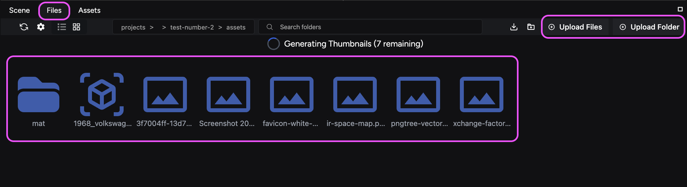
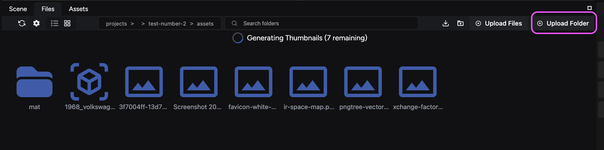

Learn to import files and assets into your project so you can use them in your scenes.

## Formats supported and size limit

For optimal performance within the iR Engine, consider these guidelines when importing assets:

### List of supported formats

Supported file formats include:

- **3D model formats:** `.glb` and `.gltf` (with `.bin` and `.ktx2`)
  - The Studio does not support `.fbx`
- **Image formats:** `.png`, `.tiff`, `.jpg`, `.gif` `.jpeg`, and `.ktx2`
- **Audio formats:** `.mp3`, `.mpeg`, `.m4a`, `.wav`
- **Video formats:** `.mp4`, `.mkv`, `.avi`

### Recommended file size

For optimal performance, *use files under 300 MB*. Files over this size affect the performance of your experience both when building it in the Studio and when users access it on the web.

## Import files into your project

Import assets into your scene via the **Files tab.** To do this, you can drag and drop or use the **Upload Files** and **Upload Folder** buttons.

These actions place the file into your folder within the **Files** tab and make it available in the **Assets** tab as well.

If you drag and drop your files, you can place them directly in the **Files** **tab**, the **Viewport**, or the **Hierarchy**. These options provide their own benefits; see the following sections to know more.

:::danger

Do not upload assets using the **Assets** tab or the **Hamburger** menu (☰). The Assets panel is being reworked and will provide an improved experience in future releases.

:::

### Importing files directly into the Viewport

To upload files directly into your scene, you can drag and drop them into a location in the Viewport. Doing this also loads them into your scene **Hierarchy**. You can view imported assets in the assets folder of the **Files** Tab.

### Importing files directly into the Hierarchy

To upload files directly into your scene, you can drag and drop them into the **Hierarchy**. Doing this also loads them into the **Viewport** at (0,0,0). You can view imported assets in the assets folder of the **Files** Tab.

## Specific format importing guides

While the iR Engine supports a variety of formats, here are some additional guidelines for specific types:

### Importing glTF files

To import a complete glTF model that consists of multiple files, you must first combine all associated files (textures, materials, etc.) into a single folder on your device.

**To upload your folder**:

1. Navigate to the **Files** tab in the Studio.
2. Click the **Upload Folder** button.
3. Select the folder containing all your glTF model files for upload.

:::note[Uploading folders]
The iR Engine does not support uploading folders using single file upload methods. Always use the **Upload Folder** button in the **Files** tab to import multiple files belonging to a single asset, like in the case of gLTF files.
:::

## Next steps

Now that your files are ready to use in your project, you can proceed to [load assets into your scenes](/scene-development/working-with-assets/load-assets-into-scenes) to begin building your experience.
