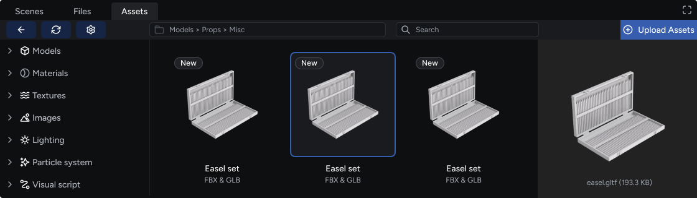
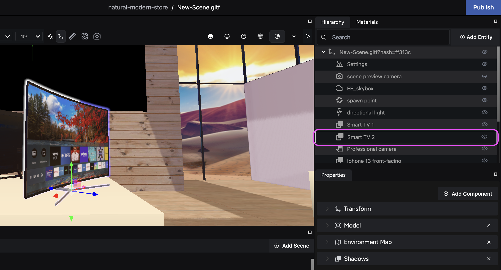
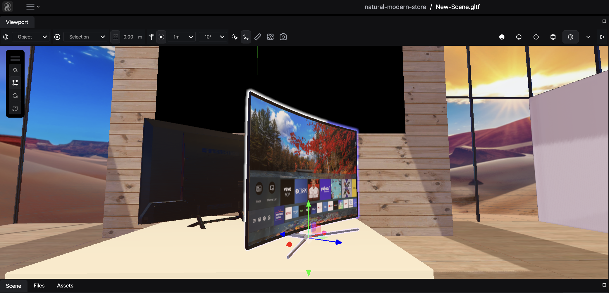
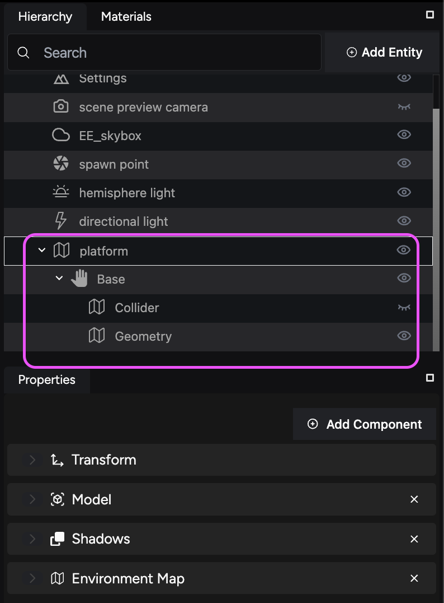

Learn to load assets into your scenes within the iR Engine Studio to enhance your projects.

## Access the Assets Library

The **Assets Library** is your central hub for all available assets. It is located inside the **Assets tab** and it includes both preloaded assets and allows you to upload your own. To access the library from the Studio:

1. Click on the **Assets** tab located in the bottom left panel.
2. Browse through categories such as **Models**, **Textures**, **Lighting**, and more. Use the search bar to quickly find specific assets.

Additionally, you can access all project-related files you have added to your project in the **Files** tab.

:::tip[Learn about asset categories]
For detailed information on Asset categories and types of assets, refer to the [Asset types guide](link).
:::

## Loading assets into your scene

To load assets into your scene from the **Assets** library or the **Files** tab, two methods exist:

- **Method 1:** Load them into the Hierarchy panel.

- **Method 2:** Load them directly into the Viewport.

The following sections contain details for both options.

### Method 1: Load assets into the Hierarchy panel

To load assets into your scene via the **Hierarchy** panel, follow these steps:

1. In the **Files** or **Assets** tab, locate the asset you want to use.
2. Drag the asset into the **Hierarchy** panel.
3. Release the asset at the desired location within the hierarchy.

### Method 2: Load assets directly into the Viewport

For a more visual placement, you can load assets directly into the **Viewport**:

1. In the **Files** or **Assets** tab, locate the asset you want to use.
2. Drag the asset into the **Viewport** at the desired location.
3. Adjust the placement as needed by dragging the asset within the viewport.

## What happens next

After placing your asset into either the **Hierarchy** or the **Viewport**, the Studio performs the following actions:

1. It creates a new entity in the **Hierarchy** panel for your asset.
2. It places your new entity at the bottom of the **Hierarchy** by default unless you add your asset to another entity.

:::note[What are entities?]
Think of entities as containers within your scene. Each entity holds a collection of assets and acts as a building block for your project.
:::

## Organize your entities

You can rearrange this entity within the **Hierarchy** to suit your scene structure. Organize entities by nesting them within other entities for better management.

## Additional tips

When loading assets and creating entities into your scene, follow these tips:

- **Use descriptive names**: Organize your project with clear and descriptive entity and material names.
- **Experiment with placement**: Adjust assets using the transform tools and hotkeys in the Viewport to achieve your desired layout.

## Next steps

Now that you have placed assets within your scene, you can proceed to add components to your entities and configure their properties. To know more about this process, visit the [Properties panel](link) guide.
