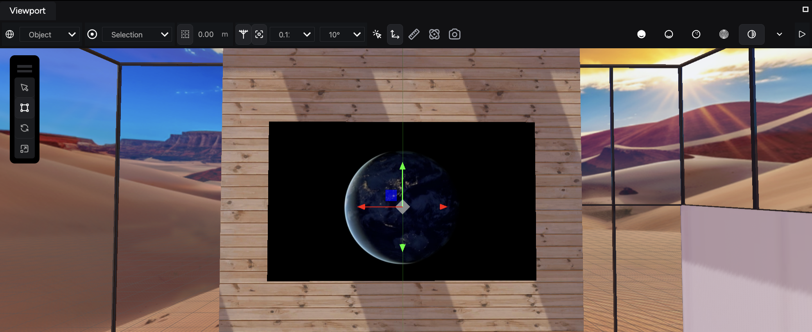

Videos can significantly enhance the interactivity and engagement of your virtual store. By adding videos to your store, you can provide promotional content, product demonstrations, or immersive environments. This guide walks you through creating video entities and configuring video resources to play within your scene.

## Step 1. Create video entities for your screens

To play videos in your store, you first need to create entities that will act as screens.

**To create a video entity:**

1. **Add a new entity:** Click the **Add Entity** button in the **Hierarchy** panel.
2. **Select Video:** From the options available, select **Video**. This action adds a new video entity to your **Hierarchy**.

    

3. **Activate the video entity:** Ensure your new video entity is selected in the **Hierarchy** panel so its components are displayed in the **Properties** panel.

## Step 2. Add video resources to your video entity

After creating a video entity, you need to specify the video source that will play on it.

**To add a video resource:**

1. **Select the video entity:** Make sure your video entity is active in the **Hierarchy** panel.
2. **Expand the Media component:** In the **Properties** panel, expand the **Media** component to view its options.

    

3. **Add a source path:** Click the **+** (plus) sign in the **Source Paths** section to add a new source path field. This field will be named **Path 1** automatically.

    

4. **Locate your video file:** Open the **Files** tab to find the video source you want to add to your entity.
5. **Add the video file to the source path:** Drag and drop your video file from the **Files** tab into the text field of the newly created source path. This action links the video file to the video entity.

    

    Alternatively, you can right-click your file in the **Files** tab and copy its URL, then paste it into the source path field.

    

## Step 3. Configure video settings

With the video source linked, you can further configure the video settings to fit your store’s needs.

**To configure video settings:**

1. **Select the video entity:**
    - Ensure your video entity is active in the **Hierarchy** panel.
2. **Adjust video settings:**
    - In the **Properties** panel, use both the **Video** and **Media** components to configure your settings. Here, you can adjust options such as playback settings, loop options, and volume control.

## Next steps: Setting up spatial audio

With videos successfully added to your store, the next guide focuses on [adding spatial audio](/tutorials-and-examples/build-an-ecommerce-store/set-up-spatial-audio). Spatial audio enhances the immersive experience by creating realistic sound environments based on object positioning and user interactions.
