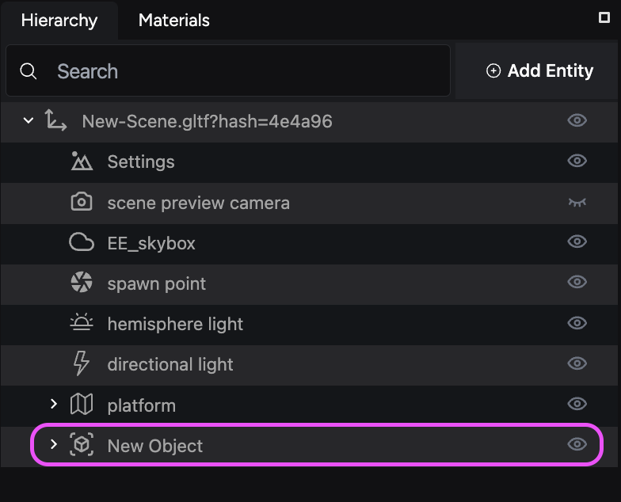
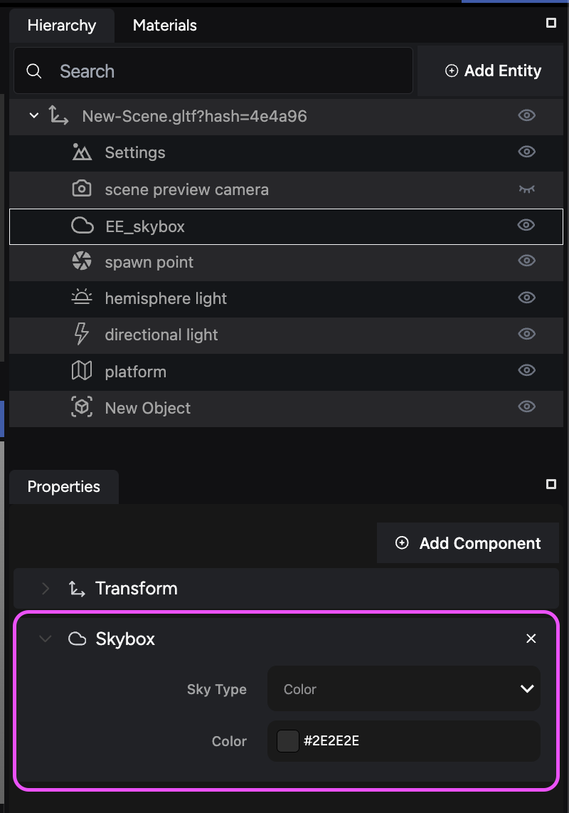
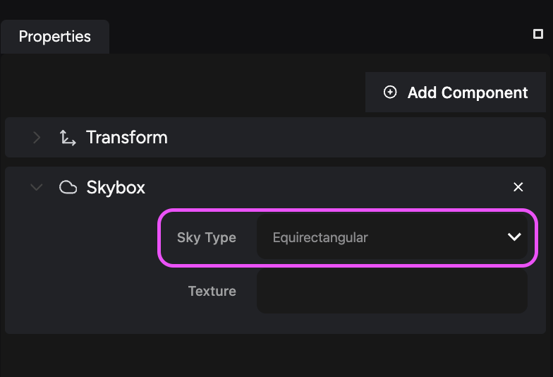

With your Shopify store integrated, it’s time to build the visual and interactive elements of your virtual store. This guide helps you use predefined templates to create a modern store layout and set the ambiance using a skybox. These steps enhance the user experience and bring your virtual shopping environment to life.

## Step 1. Launch your project in the Studio

To start building your virtual store, first, you must launch your project in the Studio.

1. **Find your project**: Locate your project on the **My Projects** page.
2. **Launch the Studio**: Select or create a scene where you want to start building your store.

This action launches your project in the Studio, making your scene active and ready for building.

## Step 2. Use a model template for your virtual store

The iR Engine provides preconfigured model templates to simplify the process of creating a virtual store. For this tutorial, use the **Natural Modern** template, which includes a fully built brick-and-mortar store with product displays and lighting.

:::note
If you cannot find templates that resemble a modern store to use in this tutorial, you may not have the necessary access. If you think this is an error, contact support at the [iR Engine support center](https://help.theinfinitereality.com/hc/en-us).
:::

**To add your store model template:**

1. **Open the assets library:** Go to the **Assets** tab located at the bottom left of the Studio interface.

    

2. **Find the model category:** In the list of assets on the left, locate and expand the **Model** category.
3. **Select the templates category:** Click **Templates** to view the available model templates.

    

4. **Choose the appropriate template:** For this tutorial, use the `NMS_HubsLM_Template_large.glb` model or any other that resembles a modern retail store. These type of files include models for your shopping experience with fully set light maps.

    

5. **Add the template to your scene:** Drag and drop your store file from the **Assets** tab into the bottom of the **Hierarchy** panel located at the top right of the Studio interface.

    

    This action creates a **New Object** with all your model’s elements. You can expand the model to see its objects, including **walls**, **flooring**, **box colliders**, **windows**, **display cases**, **ceiling**, and also the **lighting settings** of your store.

    :::caution[Ensure to drop your model in the Hierarchy]

    Do not drag the file into the **Viewport** directly. Dropping it in the **Hierarchy** panel ensures the model is properly placed on the default platform model.
    :::

6. **Preview your scene:**

   - After adding the template, the model appears in the center of your project in the **Viewport**.
   - Test the scene by clicking the preview button and using the **WASD** keys to navigate.

## Step 3. Set the ambiance of your store by adding a skybox

A skybox is a spherical environment that surrounds your scene, providing lighting and ambiance. For this tutorial, add a desert-themed skybox to create a bright and warm atmosphere. To add a skybox:

### 1. Enable skybox settings

1. Locate the **EE_skybox** entity in the **Hierarchy** panel.
2. Select the entity to open its components in the **Properties** panel.

    

3. Expand the **Skybox** component and set the **Sky Type** to **Equirectangular** from the dropdown menu.

    

### 2. Assign a skybox image

 1. In the **Assets** tab, find and expand the **Skybox** category to view available skybox images.
 2. Locate the `desert_daytime_04.png` file.

    

 3. Drag and drop the `desert_daytime_04.png` file into the **Texture** field in the **Properties** panel, ensuring the **EE_skybox** entity is selected.

Once you add the skybox, it immediately illuminates your scene. You can further configure the skybox settings in the **Hierarchy** panel.

## Next steps: Loading and placing Shopify products

With your store layout and ambiance set, the next guide focuses on [loading and placing your Shopify products](/tutorials-and-examples/build-an-ecommerce-store/load-and-place-shopify-products) within the scene. This includes creating entities, attaching ecommerce components, and positioning your products for display.
