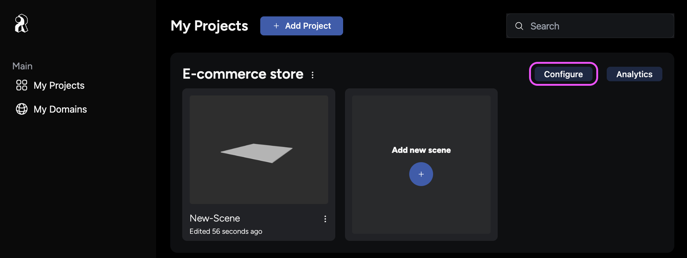
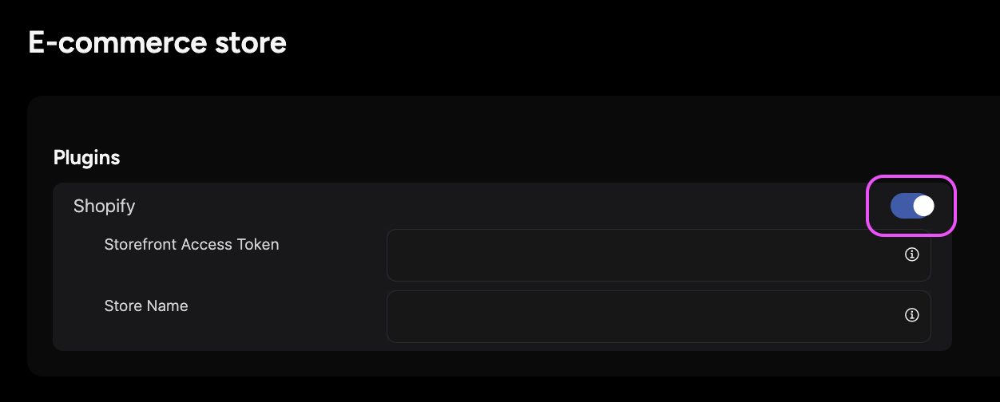

With your prerequisites set up, it's time to integrate your Shopify store with the iR Engine. This step allows you to load your Shopify products seamlessly into your virtual store. Follow the steps below to configure the Shopify plugin within your iR Engine project.

## Integrate your Shopify store

To load your Shopify products into the iR Engine, enable and configure the Shopify plugin. This process involves linking your Shopify account with your iR Engine project.

1. **Locate your project on the My Projects page:**
    - Navigate to the **My Projects** page in the iR Engine Console.
    - Find the project you want to use for building your store.
2. **Open project settings:**
    - Click the **Configure** button located at the top right of the project tile to open the project settings.

    

3. **Enable the Shopify plugin:**
    - In the project settings, find the **Plugins** section.
    - Toggle the **Shopify** switch to enable Shopify integration settings.

    

4. **Enter your Storefront Access Token:**
    - In the Shopify integration settings, locate the **Storefront Access Token** text field.
    - Enter your Shopify Storefront Access Token. It should look like this: `4beffe41538252a1dde4a6a881857782`.

5. **Enter your Store Name:**
    - Find the **Store Name** field and enter your Shopify domain’s base URL (e.g., `{store_name}`).
    - Retrieve this element from the URL of your **Shopify Admin**, typically found as `{store_name}.myshopify.com/admin`.

6. **Save your settings:**
    - After entering the necessary information, click the **Save** button to finalize the integration settings.

Completing these integration settings allows the iR Engine to access and load all the items available in your Shopify store, including 2D and 3D models. This integration is essential for placing your products into any of your virtual scenes.

:::tip[Use 3D models to enhance the experience]
3D models provide a more engaging experience for online virtual stores compared to 2D images. Consider using 3D models of your products to enhance the user experience.
:::

## Next steps: Build your store

With your Shopify store integrated, proceed to the next guide on [building your store: using templates and setting the ambiance](notion://www.notion.so/Configure-the-Shopify-plugin-7ff730ef639e4dd6be17f68c562fee1f#). This guide covers how to use pre-configured models and add a skybox to create a complete shopping environment.