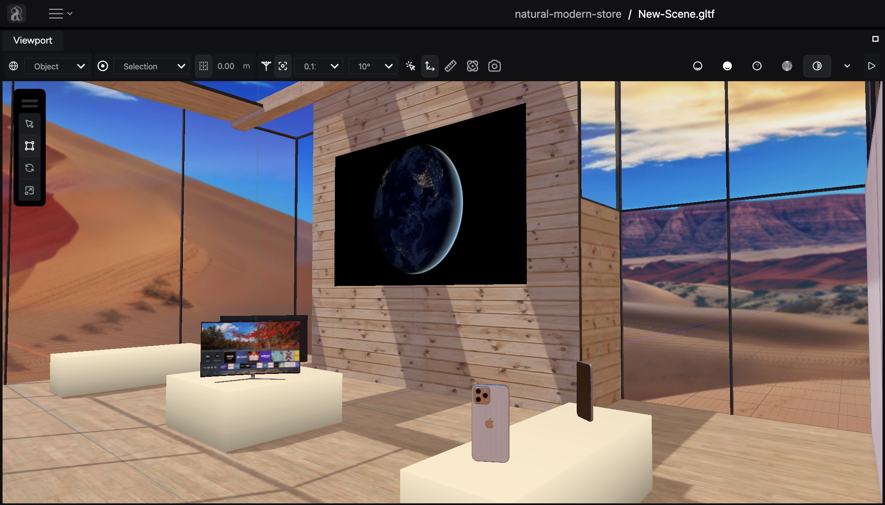

import { Steps } from '@astrojs/starlight/components';

Build a complete virtual shopping experience using the iR Engine.

## About this tutorial

With the help of this step-by-step tutorial, you can learn how to create a visually appealing online store complete with product displays, ambient lighting, and seamless Shopify integration.

**By the end of this tutorial, you will have:**

- A visually stunning virtual retail environment
- Your Shopify products showcased in your store
- An engaging atmosphere with lighting, videos, and spatial audio

By completing the tutorial, your ecommerce experience will look similar to this:

## What you need

Before we begin, ensure you have the following prerequisites:

- **iR Engine account with Studio access:** If you don't have an account, sign up on the [iR Engine website](https://www.ir.world/).
- **Empty iR Engine project:** This serves as the blank workspace for your store. If you need guidance, refer to the [Start a new project](/get-started/initial-setup/start-a-new-project) guide.
- **Shopify Storefront Access Token:** This token allows the iR Engine to access your Shopify products. Refer to Shopify's [Getting started with public access](https://shopify.dev/docs/api/usage/authentication#getting-started-with-public-access) documentation for instructions.
- **Shopify domain’s base URL:** Your store's main URL (e.g., `{store_name}.myshopify.com`).
- **Optional: 3D product models:** Enhance your store’s realism by using 3D models of your products configured in Shopify.

## Tutorial roadmap

This tutorial is divided into manageable sections to simplify the process. Here's what you'll cover:

<Steps>

1. **[Configuring the Shopify plugin](/tutorials-and-examples/build-an-ecommerce-store/configure-shopify-plugin)**: Set up the integration to bring your Shopify products into the virtual store.
2. **[Building your store: Using templates and setting the ambiance](/tutorials-and-examples/build-an-ecommerce-store/build-your-store-templates-and-ambiance)**: Use predefined templates to design the layout and add a skybox to set the ambiance.
3. **[Loading and placing Shopify products](/tutorials-and-examples/build-an-ecommerce-store/load-and-place-shopify-products)**: Import products from Shopify and arrange them in your virtual space.
4. **[Adding videos to your store](/tutorials-and-examples/build-an-ecommerce-store/add-videos-to-your-store)**: Create video entities and configure video resources to enhance the shopping experience.
5. **[Setting up spatial audio](/tutorials-and-examples/build-an-ecommerce-store/set-up-spatial-audio)**: Add and configure spatial audio to create an immersive sound environment.
6. **[Publishing your store](/tutorials-and-examples/build-an-ecommerce-store/publish-your-store)**: Make your virtual store accessible to your audience.

</Steps>

## Let's get started

With your prerequisites in place, you are ready to begin building your virtual store. Head to the first guide to [configure the Shopify plugin](/tutorials-and-examples/build-an-ecommerce-store/configure-shopify-plugin) to start the process.
