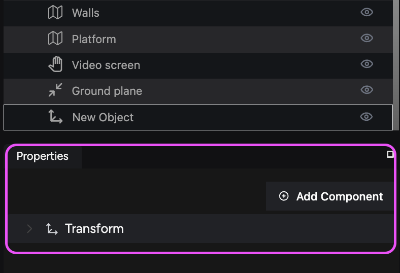

import { Steps } from '@astrojs/starlight/components';

Now that you have set up the structure and ambiance of your virtual store, it's time to populate it with products from your Shopify store. This guide walks you through creating entities to hold your products, attaching the necessary ecommerce components, and positioning your products within your scene.

## Step 1. Create an empty entity to hold your product

Entities are fundamental building blocks in the iR Engine. You will create an empty entity to which you can attach your Shopify product.

**To create an empty entity:**

<Steps>

1. **Add a new entity:** Click the **Add Entity** button located in the **Hierarchy** panel.
2. **Select Empty:** From the options available, select **Empty** to add a new empty entity to the **Hierarchy**.

    

3. **Make the entity active:** Ensure your new entity is selected in the **Hierarchy** panel so its components are displayed in the **Properties** panel.

    

</Steps>

## Step 2. Attach an Ecommerce Product component to your entity

To load a product into your entity, you need to add an Ecommerce Product component.

**To add an Ecommerce Product component:**

<Steps>

1. **Add a new component:** In the **Properties** panel, click **Add Component**.
2. **Expand the Ecommerce category:** Click on the **Ecommerce** category to see the available components.
3. **Select Ecommerce Product:** Choose **Ecommerce Product** from the list. This action adds the component to your entity.
4. **Configure the component:** Expand the newly added **Ecommerce Product** component in the **Properties** panel to view its settings.

</Steps>

## Step 3. Load your product into the entity

With the Ecommerce Product component in place, you can now load your product into the entity.

**To load a product:**

<Steps>

1. **Select Shopify as the provider:** In the **Provider** dropdown menu, select **Shopify**.

    

2. **Choose a product:** In the **Product** dropdown menu, select the product you want to load. This action configures the component to display the selected product.

    

3. **Verify the product loads:** The entity now populates with the model of the selected product. You can see the product appear in the Viewport.

    

</Steps>

:::note[Can't view your Shopify products?]
If the list of products does not show any of your Shopify products, ensure your store is correctly set up. Revisit the [Configure the Shopify plugin](/tutorials-and-examples/build-an-ecommerce-store/configure-shopify-plugin) guide to confirm proper integration.
:::

## Step 4. Position your product in the scene

You can move and position your product within the scene to create an appealing display.

**To position your product:**

<Steps>

1. **Use the Transform component:**
    1. Select the entity in the **Hierarchy** panel.
    2. In the **Properties** panel, expand the **Transform** component to adjust the position, rotation, and scale of your product.
2. **Direct manipulation in the Viewport:** Alternatively, directly manipulate the product in the **Viewport** by selecting it and using the **move**, **rotate**, and **scale** tools.

</Steps>

:::tip[Grouping entities for easier positioning]

To position products more easily, group your product entity with another entity, like a table or shelf, in the **Hierarchy**. This approach helps you move and align products accurately within your scene.

:::

## Expanding and viewing product details

When you load a Shopify product into your scene, clicking on it in the Viewport displays its details, such as description, price, and add-to-cart options. This interaction helps simulate the user shopping experience of your users.

## Next steps: Adding videos to your store

With your products loaded and positioned, the next guide focuses on enhancing your virtual experience by [adding videos to you store](/tutorials-and-examples/build-an-ecommerce-store/add-videos-to-your-store). This includes creating video entities and configuring video resources to play within your scene.
