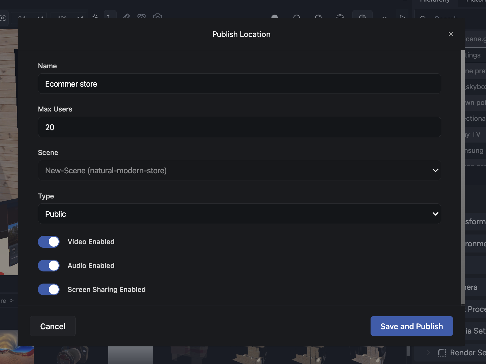
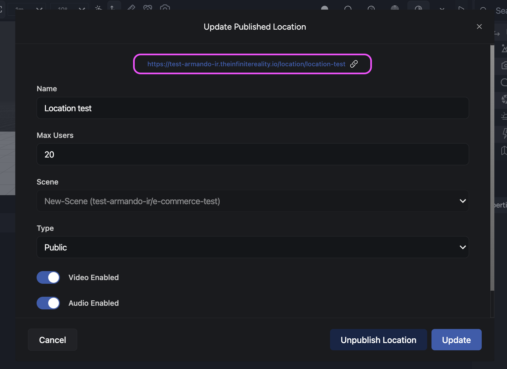

This guide walks you through the process of publishing your store in the iR Engine.

## Publishing your store

After building and configuring your virtual store, the final step is to publish it. Publishing your store makes it accessible to users via a web link, known as **Location**, allowing them to explore and interact with your creation.

## Step 1. Prepare your scene for publication

Before publishing, ensure that your scene is complete and all elements are properly configured. This includes:

- Verifying that all products are correctly loaded and positioned.
- Checking that video and audio components function as expected.
- Ensuring the overall look and feel of your store meets your desired standards.

## Step 2. Publish your store

**To publish your store:**

1. **Open the publishing menu:** In the Studio interface, locate the **Publish** button at the top right of the screen.

    

2. **Configure virtual space details:**
    1. Click the **Publish** button to open the publishing menu.

        

    2. Fill in the necessary details for your virtual space; define maximum users, along with video, audio, and screen sharing options, and choose the type of location:
        - **Private**: Only users with specific access can enter.
        - **Public**: Anyone with the link can access the Location.
        - **Showroom**: A special type of public Location designed for demonstrations.
3. **Save and publish:** After configuring the details, click **Save and Publish**. This action creates a new virtual space link for your store.
4. **Retrieve the link:**
    1. Once the publishing process is complete, the window displays the link to your virtual store at the top center.
    2. Copy this link to share it with your users.

        

## Step 3. Access and explore your store

**To access your store:**

1. **Open the link in a web browser:** Paste the copied link into your web browser’s address bar and press **Enter**.
2. **Explore your store:** Navigate through your virtual store, interacting with products, videos, and audio elements to ensure everything functions as intended.

## Conclusion

Congratulations! 🎉 You have successfully built and published your virtual store using the iR Engine. By following these guides, you have created an immersive shopping experience for your users, complete with product displays, video content, and spatial audio.

Share the link with your audience and invite them to explore your new virtual retail environment.
