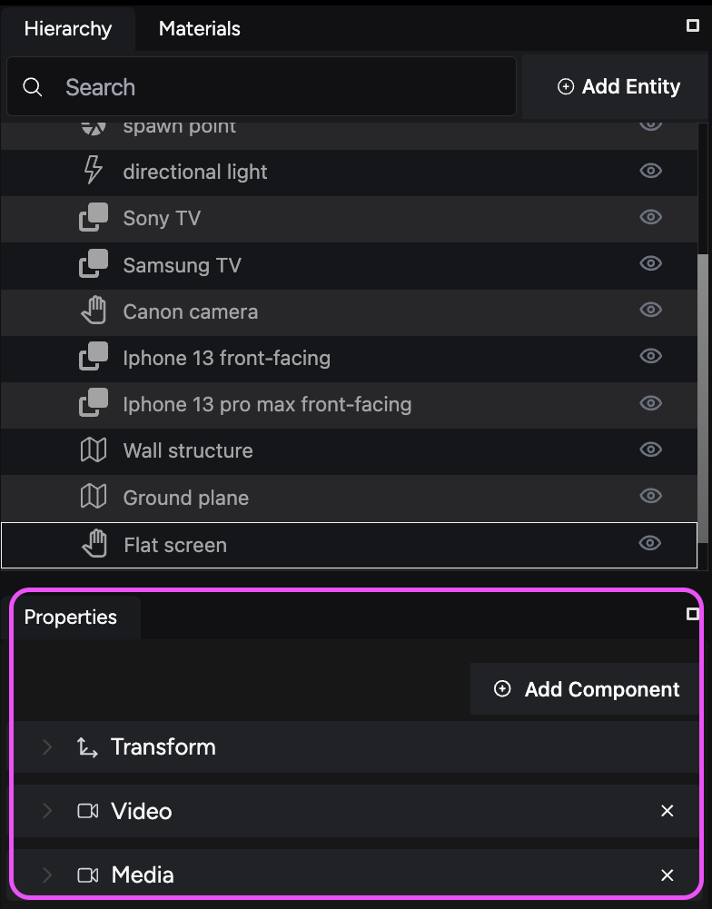

This guide walks you through loading an audio file, attaching it to an entity, and configuring the spatial audio settings.

## About spatial audio

Adding spatial audio to your virtual store enhances the immersive experience by creating a realistic sound environment. Spatial audio allows you to configure audio settings based on object positioning and proximity to the user’s avatar. 

## Step 1. Load your audio file and attach it to your entity

First, load an audio file and attach it to an entity in your scene.

**To load an audio file:**

1. **Select your entity:** Choose the entity to which you want to attach the audio file in the **Hierarchy** panel to display its properties.

    

2. **Expand the Media component:** In the **Properties** panel, expand the **Media** component to view its options.
3. **Add a source path:** Click the **+** (plus) sign in the **Source Paths** section to create a new field named **Path 1**.

    

4. **Locate your audio file:** Open the **Files** tab to find the audio source you want to use.
5. **Attach the audio file:** Drag and drop your audio file from the **Files** tab into the source path text field. This action links the audio file to the entity.

    

    Alternatively, right-click the file in the **Files** tab, copy its URL, and paste it into the source path field.

## Step 2. Set up a positional audio component in your entity

Once the audio file is attached, add a positional audio component to your entity to enable spatial audio settings.

**To add a positional audio component:**

1. **Activate your entity:** Ensure your entity is selected and active in the **Hierarchy** panel.
2. **Add a new component:** Click the **Add Component** button in the **Properties** panel to display the list of available components.
3. **Find the audio component:** Enter **Audio** in the search bar to locate the audio components.

    

    Alternatively, find it inside the **Files** component category.

4. **Add the Audio component:** Select **Audio** from the options. This action adds the **Positional Audio** component to the **Properties** panel.

    

## Step 3. Configure the positional audio settings

After adding the positional audio component, configure its settings to define how the audio behaves in the scene.

**To configure positional audio:**

1. **Expand the Positional Audio component:** In the **Properties** panel, expand the **Positional Audio** component to view its settings.

    

2. **Adjust audio settings:** Configure settings such as the **distance model**, **rolloff factor**, **reference distance**, **audio cone angles**, and **max distance**. 

    These settings determine how the audio is perceived based on the listener’s position relative to the audio source.

3. **Test the spatial audio: Save** your scene and use the **preview** function to test the spatial audio settings. Move around the scene to ensure the audio behaves as expected, creating a realistic and immersive environment.

## Next steps: Publishing your store

With spatial audio set up, your virtual store is nearly complete. The final guide focuses on publishing your store, making it accessible to users via a web link.
